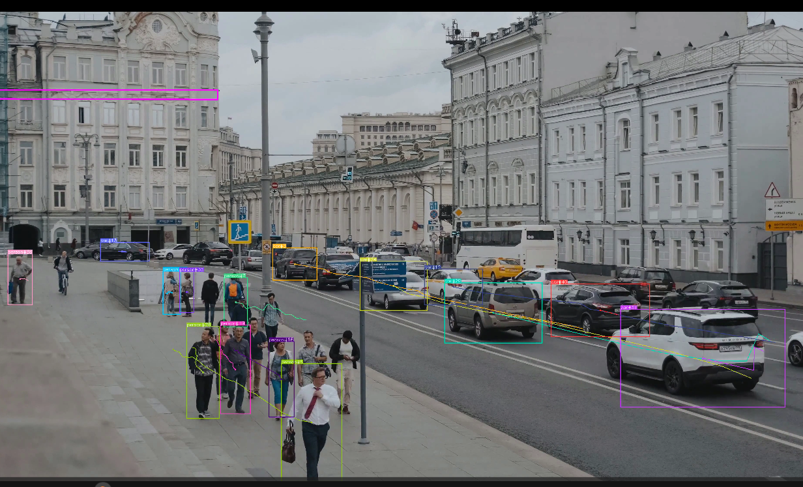

# YOLOs
YOLO Computer Vision Projects

### **YOLOv8 Smoke Detection on custom data**
And here is an example detected images:

To get started with this project, you can refer to the code and instructions in the [YOLOv8 Smoke Detection](YOLOv8 Smoke Detection/) directory.

### **YOLOv8 Object Counting**

video link: [LINK](https://drive.google.com/file/d/1D6JdCjS_pD9cX72hBXQWxlYI81iI0wj_/view?usp=sharing)

### **YOLOv3 in using cv2.dnn.readNetFrom()**

